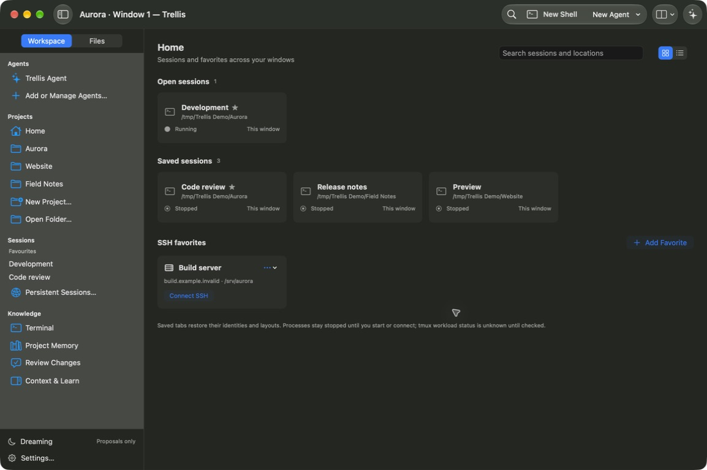
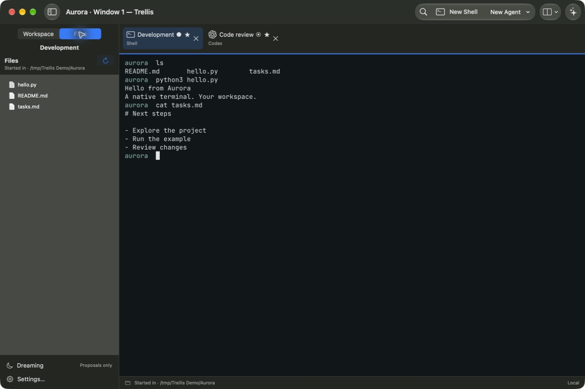

# Trellis

A native macOS terminal built with SwiftUI and libghostty, with agent conversations,
configurable workspaces and project Markdown memory.

Requires Apple Silicon and macOS 27. Trellis is early software; see
[current status and limitations](docs/STATUS.md).



Home keeps open and saved sessions together. This screenshot uses disposable example projects.

## Install

Download the DMG from [GitHub Releases](https://github.com/thesammykins/trellis/releases),
open it and drag Trellis to Applications. Public releases use Developer ID signing
and Apple notarization. Check for updates from the Trellis menu or Settings → Updates.
Automatic checking is optional; installing an update remains explicit.

## Use

- Home shows open and saved shells, agents and SSH locations as searchable cards or a list.
- Organize sessions across windows and up to eight panes per tab, with balancing and temporary maximization.
- Reopen the saved workspace after quitting. Start local shells or reconnect remote sessions explicitly; running processes are not restored by the app.
- Use your ChatGPT sign-in through the installed Codex app-server, retaining native Codex tools, approvals, history and model discovery.
- Configure direct API connections and specialist agents with @ assignment, delegation, escalation and shared task limits.
- Review the action and reason before commands run. The Direct API harness can submit an approved command to its visible local Ghostty terminal.
- Schedule commands while Trellis is open, and review project memory and reusable tool proposals before applying them.

The [agent guide](docs/BUILT-IN-AGENT.md), [accounts guide](docs/MODELS-AND-AUTH.md)
and [session guide](docs/TERMINAL-AND-SESSIONS.md) explain setup and boundaries.
Subscriptions are used through supported native agent integrations; direct API
connections require the provider's credentials and billing.



The running Ghostty terminal, with example files and real shell output.

## Contribute

Start with [CONTRIBUTING.md](CONTRIBUTING.md) for a fresh checkout, prerequisites,
feature workflow, Conventional Commits and pull request expectations.

### Build and verify

Xcode 27 is required. Follow [dependencies](DEPENDENCIES.md) for the pinned Ghostty
and Zig toolchain, then run:

```sh
./script/build_and_run.sh --verify
./script/check-features.sh
./script/check-host.sh
```

For a local app bundle and installer:

```sh
./script/package-personal.sh
./script/build-dmg.sh
```

Outputs are in `dist/`. Local packaging defaults to ad-hoc signing. See
[release setup](docs/GITHUB-RELEASE.md) and [automatic updates](docs/AUTO-UPDATES.md)
for signed distribution. Generated apps, logs, screenshots and credentials stay
outside Git, except reviewed public screenshots. [AGENTS.md](AGENTS.md) contains
repository guidance for coding agents.

## Documentation

- [Changelog](CHANGELOG.md), [product intent](PRODUCT-BRIEF.md),
  [architecture](ARCHITECTURE.md) and [design](DESIGN.md)
- [Agent integrations](docs/AGENT-INTEGRATIONS.md),
  [provider compatibility](docs/PROVIDER-COMPATIBILITY.md) and [SSH](docs/REMOTE-AND-SSH.md)
- [Memory](docs/MEMORY-AND-DREAMING.md),
  [security](docs/SECURITY-AND-PRIVACY.md) and [verification](docs/VERIFICATION.md)

## License

Trellis source is [MIT licensed](LICENSE). Third-party components, fonts and assets
retain their own licenses and notices under `Vendor/` and beside their assets.
